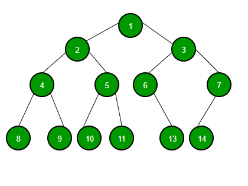

# Binary tree

A tree whose elements have at most 2 children is called a binary tree. Since each element in a binary tree can have only 2 children, we typically name them the left and right child.

.

A Binary Tree node contains following parts.

1. Data
2. Pointer to left child
3. Pointer to right child

## Properties

1. The maximum number of nodes at level ‘l’ of a binarytree is 2<sup>l</sup>.
2. The Maximum number of nodes in a binary tree of height ‘h’ is 2h – 1. 
In some books, the height of the root is considered as 0. In this convention, the above formula becomes 2h+1 – 1 
3. In a Binary Tree with N nodes, minimum possible height or the minimum number of levels is Log2(N+1).
4. A Binary Tree with L leaves has at least | Log2L |+ 1   levels. 
5. In Binary tree where every node has 0 or 2 children, the number of leaf nodes is always one more than nodes with two children.
6. In a non empty binary tree, if n is the total number of nodes and e is the total number of edges, then e = n-1

# Types of Binary Tree
1. Full Binary - Tree A Binary Tree is a full binary tree if every node has 0 or 2 children. The following are the examples of a full binary tree. We can also say a full binary tree is a binary tree in which all nodes except leaf nodes have two children. 

```
              18
           /       \  
         15         30  
        /  \        /  \
     40    50    100    40


             18
           /    \   
         15     20    
        /  \       
      40    50   
    /   \
   30   50


               18
            /     \  
          40       30  
                   /  \
                 100   40
```
Practical example of Complete Binary Tree is `Binary Heap`. 

2. Complete Binary Tree - A Binary Tree is a Complete Binary Tree if all the levels are completely filled except possibly the last level and the last level has all keys as left as possible
```
               18
           /       \  
         15         30  
        /  \        /  \
      40    50    100   40


               18
           /       \  
         15         30  
        /  \        /  \
      40    50    100   40
     /  \   /
    8   7  9 
```
3. Perfect Binary - Tree A Binary tree is a Perfect Binary Tree in which all the internal nodes have two children and all leaf nodes are at the same level. 
```
               18
           /       \  
         15         30  
        /  \        /  \
      40    50    100   40


               18
           /       \  
         15         30
```

In a Perfect Binary Tree, the number of leaf nodes is the number of internal nodes plus 1   

 L = I + 1 Where L = Number of leaf nodes, I = Number of internal nodes.

A Perfect Binary Tree of height h (where the height of the binary tree is the number of edges in the longest path from the root node to any leaf node in the tree, height of root node is 0) has 2h+1 – 1 node. 

An example of a Perfect binary tree is ancestors in the family. Keep a person at root, parents as children, parents of parents as their children.

4. Balanced Binary Tree - A binary tree is balanced if the height of the tree is O(Log n) where n is the number of nodes. For Example, the `AVL tree` maintains O(Log n) height by making sure that the difference between the heights of the left and right subtrees is at most 1. `Red-Black trees` maintain O(Log n) height by making sure that the number of Black nodes on every root to leaf paths is the same and there are no adjacent red nodes. Balanced Binary Search trees are performance-wise good as they provide O(log n) time for search, insert and delete.

5. A degenerate (or pathological) tree A Tree where every internal node has one child. Such trees are performance-wise same as linked list.
```
      10
      /
    20
     \
     30
      \
      40 
```